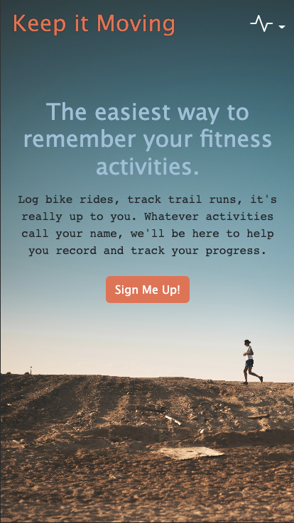
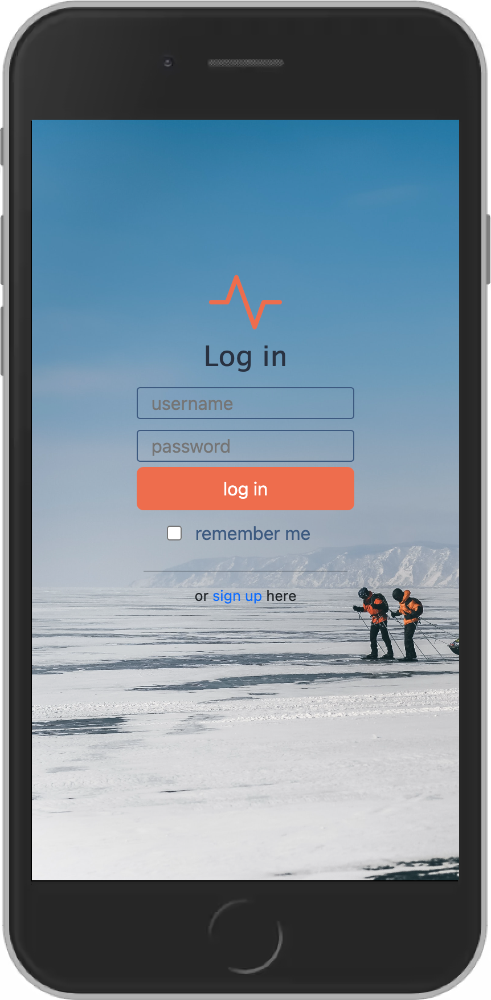
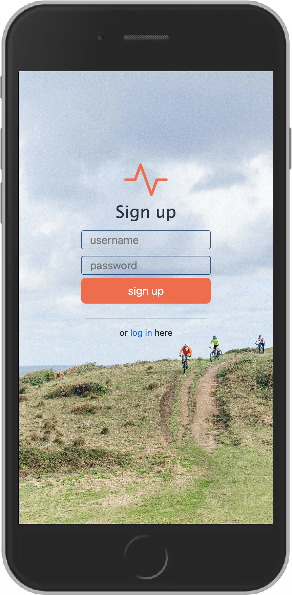

# 🏃‍♀️ Keep it Moving

## Description

Keep it Moving is an easy to use mobile workout tracker designed for the user looking for a straightforward experience. No extraneous features. Just what is necessary. It's easy to join and start logging your workouts today. Visit the deployed site [here](https://show-up-sab.herokuapp.com/)!



## Table of Contents

- [Installation](#installation)
- [Usage](#usage)
- [License](#license)
- [Contributing](#contributing)
- [Tests](#tests)
- [Questions](#questions)
- [Badges](#badges)
- [Credits](#credits)

## Installation

### For Exercise Enthusiasts:

It's simple! Visit the site [here](https://show-up-sab.herokuapp.com/), and start logging your workouts 📝

### For Developers:

To install this application's code:

- Clone [the repo](https://github.com/sabhanson/show-up) from my Github to your local machine
- Open VSCode and run the following command in the built-in terminal to install the necessary node packages

```
npm install
```

- It will be beneficial to have nodemon package installed to run a server on your local machine. If nodemon is not already installed, run the following command in the built-in terminal.

```
npm install -g nodemon
```

- Then, run the command below to start the nodemon server.

```
nodemon server.js
```

- Now the server should be live at `http://localhost:3001`
- Congrats, you have successfully installed this application ✅

## Usage

Visit the [deployed site](https://show-up-sab.herokuapp.com/). Sign up or log in to your account. Add new logs by clicking the nav button in the top right corner.

## License

<p>
MIT License

Copyright &copy; 2022

Permission is hereby granted, free of charge, to any person obtaining a copy
of this software and associated documentation files (the "Software"), to deal
in the Software without restriction, including without limitation the rights
to use, copy, modify, merge, publish, distribute, sublicense, and/or sell
copies of the Software, and to permit persons to whom the Software is
furnished to do so, subject to the following conditions:

The above copyright notice and this permission notice shall be included in all
copies or substantial portions of the Software.

THE SOFTWARE IS PROVIDED "AS IS", WITHOUT WARRANTY OF ANY KIND, EXPRESS OR
IMPLIED, INCLUDING BUT NOT LIMITED TO THE WARRANTIES OF MERCHANTABILITY,
FITNESS FOR A PARTICULAR PURPOSE AND NONINFRINGEMENT. IN NO EVENT SHALL THE
AUTHORS OR COPYRIGHT HOLDERS BE LIABLE FOR ANY CLAIM, DAMAGES OR OTHER
LIABILITY, WHETHER IN AN ACTION OF CONTRACT, TORT OR OTHERWISE, ARISING FROM,
OUT OF OR IN CONNECTION WITH THE SOFTWARE OR THE USE OR OTHER DEALINGS IN THE
SOFTWARE.

  </p>

## Contributing

To contribute, please contact me via [Github](https://www.github.com/sabhanson) or
[email](mailto:sabhanson7@gmail.com).

## Tests

Testing was all self-done in the terminal and console.

## Questions

Contact me via
[Github ](https://www.github.com/sabhanson) or [email](mailto:sabhanson7@gmail.com)

## Badges

## Credits

- Dumbbell Favicon by [favicon.cc](https://www.favicon.cc/?action=edit_image&file_id=936438)
- Reference for [remember me checkbox](https://codepen.io/AllThingsSmitty/pen/pOoeyz)
- Running Image by [Orest Sv: ](https://www.pexels.com/photo/photo-of-person-running-on-dirt-road-1821694/)
- Biking Image by [Nataliya Vaitkevich](https://www.pexels.com/photo/people-biking-on-a-dirt-road-5712935/])
- Skiing Image by [Maksim Romashkin](https://www.pexels.com/photo/unrecognizable-backpackers-skiing-on-frozen-lake-in-winter-7108244/)
