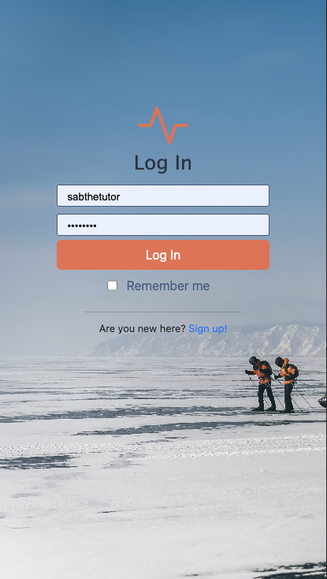
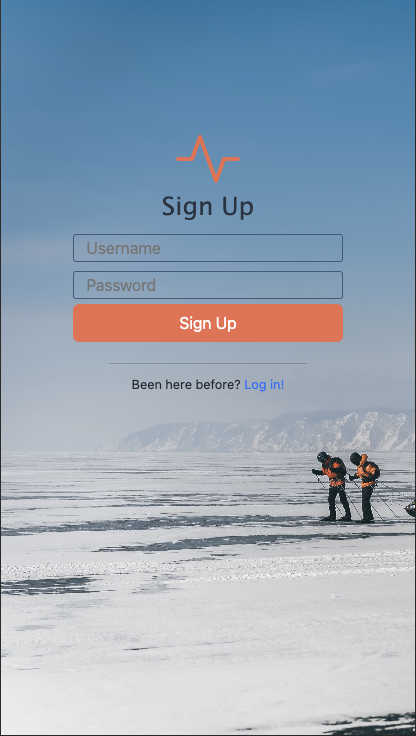

# 🏃‍♀️ Keep it Moving

## Description

Keep it Moving
is an easy to use workout tracker designed for the user looking for a straightforward experience. no extraneous features. Just what is necessary.

 

## Table of Contents

- [installation](#installation)
- [Usage](#usage)
- [License](#license)
- [Contributing](#contributing)
- [Tests](#tests)
- [Questions](#questions)
- [Badges](#badges)
- [Credits](#credits)

## Installation

## Usage

## License

## Contributing

## Tests

## Questions

## Badges

## Credits

- data visualization by [chart JS](https://www.chartjs.org/docs/latest/ 'great npm package for graphs, pie charts, etc')
- dumbbell favicon by [favicon.cc](https://www.favicon.cc/?action=edit_image&file_id=936438)
- [reference for remember me checkbox](https://codepen.io/AllThingsSmitty/pen/pOoeyz)
- [running image by Orest Sv: ](https://www.pexels.com/photo/photo-of-person-running-on-dirt-road-1821694/)
- [biking image by Nataliya Vaitkevich](https://www.pexels.com/photo/people-biking-on-a-dirt-road-5712935/])
- [skiing image by Maksim Romashkin](https://www.pexels.com/photo/unrecognizable-backpackers-skiing-on-frozen-lake-in-winter-7108244/)
