# Routes Documentation

These are screenshots of the views for all of my controller routes

## Home Routes

`/ endpoint`

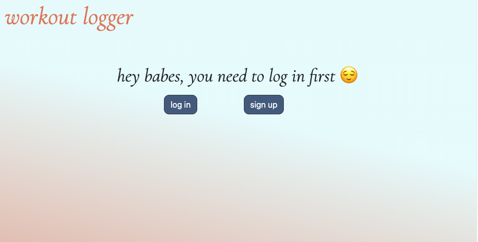

`/login endpoint`

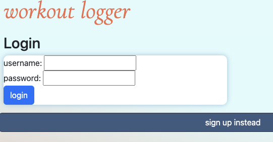

`/signup endpoint`

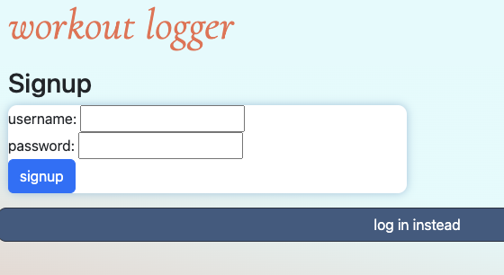

## User Routes

`/api/users/signup endpoint`

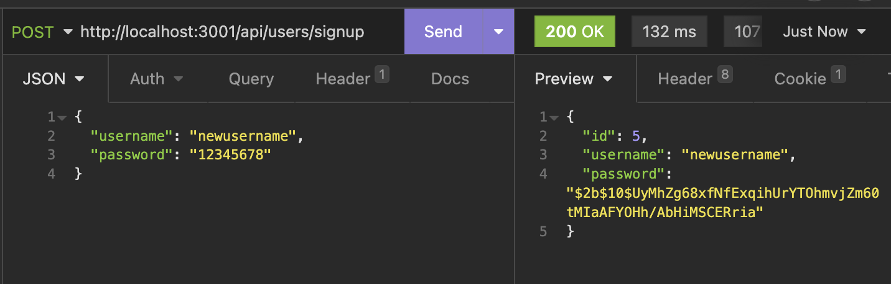

`/api/users/login endpoint`

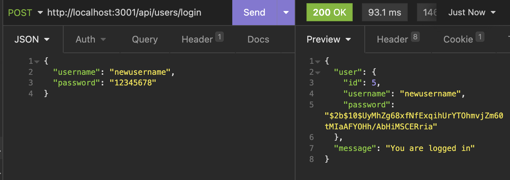

`/api/users/logout endpoint`

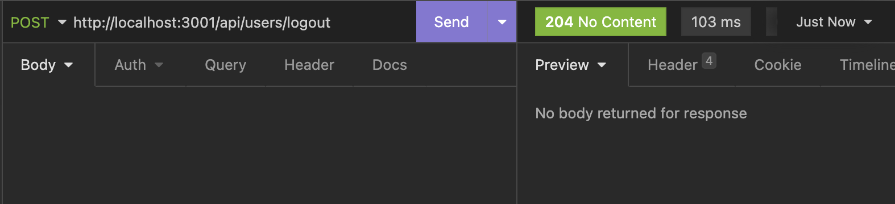

`/api/users/allUsers endpoint`

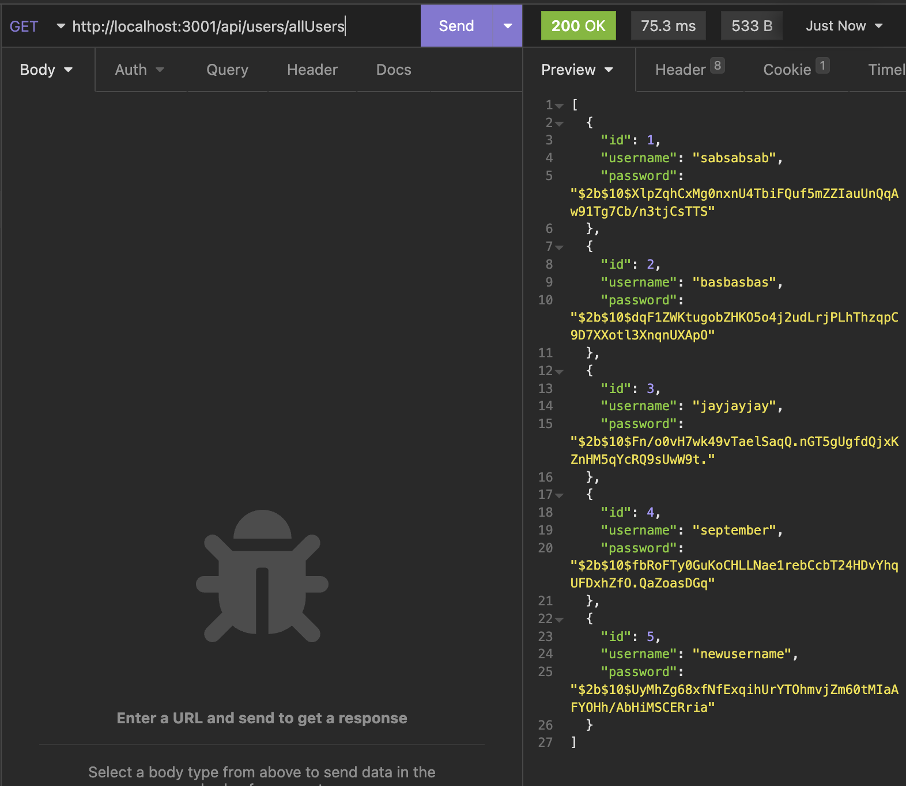

## Log Routes

`/api/logs endpoint`

- withAuth; requires a registered user to be logged in to view  
  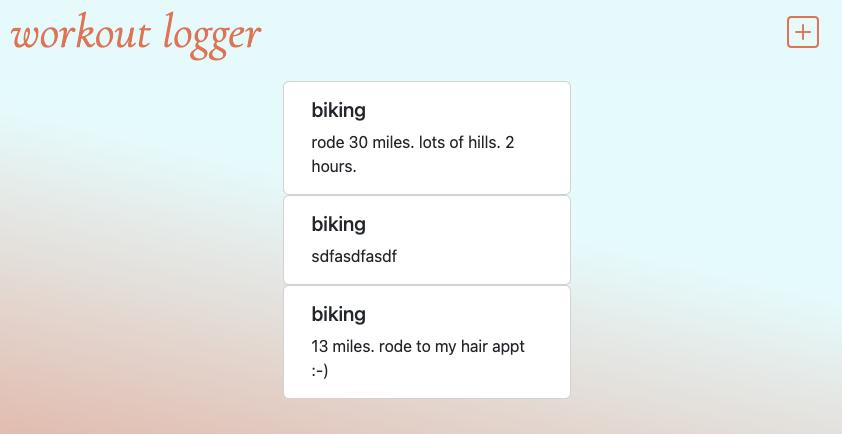

`/api/logs/newLog endpoint`

- POST route to create a new log
  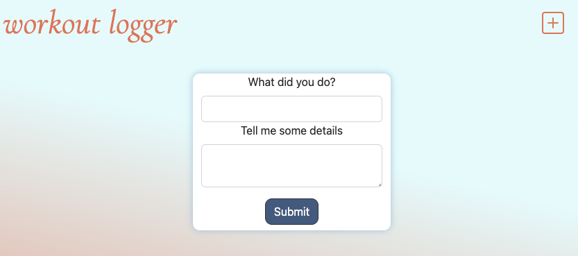

- GET route to render the new log form
  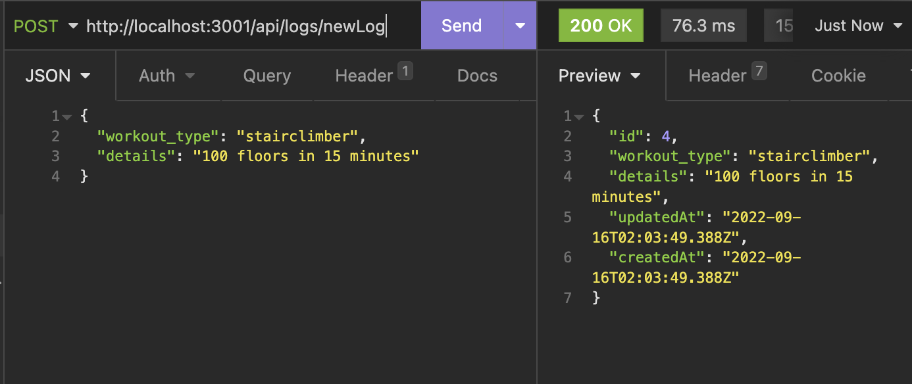

`/api/logs/:type endpoint`

- filter by workout_type
  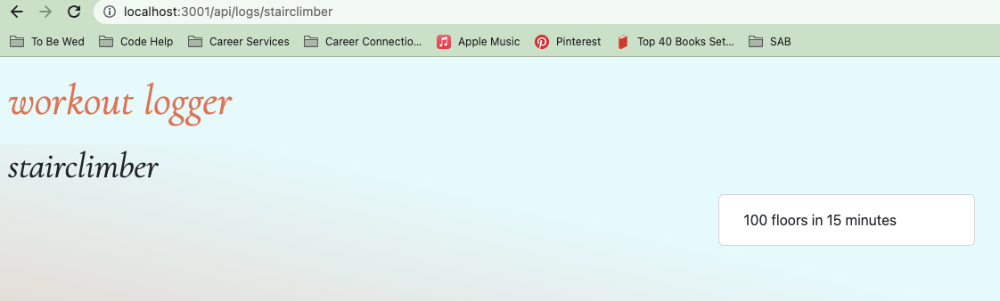
